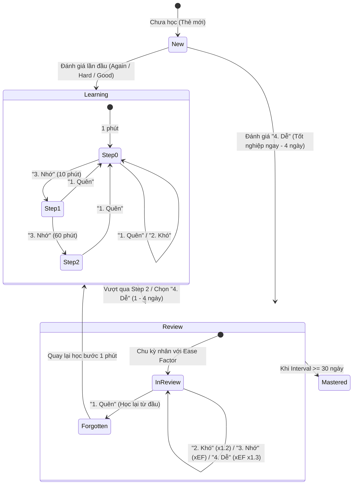

# HỆ THỐNG HỌC LẶP LẠI NGẮT QUÃNG ANKI SRS (SPACED REPETITION SYSTEM)

Tài liệu này mô tả toàn diện kiến trúc, nguyên lý khoa học, thuật toán toán học và cách thức hoạt động chi tiết của hệ thống **Anki Spaced Repetition System (SRS)** được tích hợp trong ứng dụng học tiếng Nhật **N3 Master**.

---

## 1. KHÁI QUÁT HỆ THỐNG (OVERVIEW)

### 1.1. Mục tiêu & Nguyên lý khoa học
- **Cơ sở khoa học:** Dựa trên **Đường cong quên lãng (Forgetting Curve)** của Hermann Ebbinghaus và thuật toán **SM-2 (SuperMemo-2)** của Tiến sĩ Piotr Wozniak.
- **Nguyên lý hoạt động:** Thay vì ôn tập ngẫu nhiên hoặc nhồi nhét, hệ thống tự động tính toán thời điểm "vừa chớm quên" của từng thẻ để nhắc lại. Mỗi lần bạn ghi nhớ thành công, khoảng thời gian lặp lại kế tiếp sẽ được mở rộng ra theo cấp số nhân, chuyển đổi kiến thức từ **bộ nhớ ngắn hạn** sang **bộ nhớ dài hạn**.

### 1.2. Phạm vi áp dụng
Hệ thống Anki SRS được tích hợp liền mạch cho cả **3 bộ thẻ N3**:
1. **Từ vựng (Vocabulary):** Đánh giá độ nhớ từ, kanji và phát âm.
2. **Hán tự (Kanji):** Đánh giá mặt chữ Hán, âm Hán-Việt và từ ghép điển hình.
3. **Ngữ pháp (Grammar):** Đánh giá cấu trúc mẫu câu, cách dùng và ví dụ.

---

## 2. KIẾN TRÚC DỮ LIỆU & BẢO QUẢN TRẠNG THÁI (DATA PERSISTENCE)

### 2.1. Cấu trúc thẻ SRS (`SRSCard`)
Mỗi từ vựng, kanji hoặc mẫu cấu trúc ngữ pháp khi học sẽ tạo ra một đối tượng `SRSCard` tương ứng với định dạng dưới đây:

```typescript
export interface SRSCard {
  itemId: string;        // ID duy nhất của từ vựng/kanji/ngữ pháp
  itemType: 'vocabulary' | 'kanji' | 'grammar';
  state: CardState;      // Trạng thái thẻ: 'new' | 'learning' | 'review' | 'mastered' | 'forgotten'
  easeFactor: number;    // Hệ số dễ nhớ (mặc định: 2.5, tối thiểu: 1.3)
  interval: number;      // Khoảng thời gian lặp lại (tính bằng ngày)
  repetitions: number;   // Số lần ôn tập thành công liên tiếp
  dueDate: string;       // Thời điểm cần ôn tập tiếp theo (ISO-8601 Timestamp)
  lastReview: string | null;
  totalReviews: number;  // Tổng số lần đã đánh giá
  correctCount: number;  // Số lần trả lời đúng
  learningStep: number;  // Bước học ngắn hạn hiện tại (0 -> 1 -> 2)
}
```

### 2.2. Biến nhớ vĩnh viễn (LocalStorage Persistence)
Toàn bộ tiến độ và cài đặt đều được lưu trữ trực tiếp tại LocalStorage của trình duyệt, đảm bảo **không bao giờ mất dữ liệu kể cả khi đóng tab, tắt web hoặc khởi động lại máy**:
- `n3_srs_cards`: Mảng JSON chứa toàn bộ các thẻ SRS đã và đang học.
- `n3_anki_mode_enabled`: Biến cờ boolean (`true` / `false`) lưu trạng thái bật/tắt chế độ Anki trên giao diện.
- `n3_study_activity`: Lịch sử học tập theo ngày, phục vụ tính chuỗi ngày học (`Streak`) và thẻ đã học hôm nay trên Dashboard.

---

## 3. SƠ ĐỒ CHUYỂN ĐỔI TRẠNG THÁI (STATE TRANSITION DIAGRAM)

Dưới đây là sơ đồ vòng đời của một thẻ flashcard trong hệ thống N3 Master SRS:



---

## 4. CHI TIẾT THUẬT TOÁN SM-2 VÀ CÁCH TÍNH 4 MỨC ĐỘ NHỚ

Hệ thống sử dụng các bước ngắn hạn (`LEARNING_STEPS`) bằng phút cho giai đoạn làm quen: `[1 phút, 10 phút, 60 phút]`.

### 4.1. Phím 1: QUÊN (`again` - Phím số 1)
- **Ý nghĩa:** Không nhớ ra đáp án hoặc trả lời sai.
- **Hành động toán học:**
  - **Với thẻ đang làm quen (`learning`):** Đưa thẻ về bước học đầu tiên (`learningStep = 0`), hẹn lặp lại sau **1 phút**.
  - **Với thẻ đang ôn tập (`review` / `mastered`):** Thẻ bị đánh dấu là đã quên (`state = 'forgotten'`), chu kỳ quay về **1 ngày**, số lần lặp liên tiếp (`repetitions`) bị reset về `0`.
  - **Điều chỉnh Ease Factor:** Giảm mạnh để xuất hiện dày hơn:
    $$\text{EF}_{\text{mới}} = \max(1.3, \text{EF}_{\text{cũ}} - 0.2)$$

### 4.2. Phím 2: KHÓ (`hard` - Phím số 2)
- **Ý nghĩa:** Nhớ được đáp án nhưng tốn nhiều thời gian suy nghĩ, cảm thấy khó.
- **Hành động toán học:**
  - **Với thẻ đang làm quen (`learning`):** Giữ nguyên ở bước học hiện tại (ví dụ đang ở bước **10 phút** thì hẹn lại đúng sau 10 phút).
  - **Với thẻ đang ôn tập (`review`):** Chu kỳ tăng chậm hơn bình thường (chỉ tăng 20%):
    $$\text{Interval}_{\text{mới}} = \max(1, \text{round}(\text{Interval}_{\text{cũ}} \times 1.2))$$
  - **Điều chỉnh Ease Factor:** Giảm nhẹ:
    $$\text{EF}_{\text{mới}} = \max(1.3, \text{EF}_{\text{cũ}} - 0.15)$$

### 4.3. Phím 3: NHỚ (`good` - Phím số 3)
- **Ý nghĩa:** Nhớ rõ đáp án với tốc độ phản xạ bình thường.
- **Hành động toán học:**
  - **Với thẻ đang làm quen (`learning`):** Chuyển sang bước tiếp theo (`1 phút` -> `10 phút` -> `60 phút`). Khi hoàn thành bước thứ 3, thẻ **tốt nghiệp sang chế độ Review** với chu kỳ đầu tiên là **1 ngày**.
  - **Với thẻ đang ôn tập (`review`):** Chu kỳ lặp lại được nhân theo Hệ số dễ nhớ (`Ease Factor` - trung bình gấp 2.5 lần):
    $$\text{Interval}_{\text{mới}} = \max(1, \text{round}(\text{Interval}_{\text{cũ}} \times \text{EF}_{\text{cũ}}))$$
  - **Điều chỉnh Ease Factor:** Giữ nguyên giá trị `EF` hiện tại.

### 4.4. Phím 4: DỄ (`easy` - Phím số 4)
- **Ý nghĩa:** Từ rất quen thuộc, nhìn là phản xạ ra ngay lập tức.
- **Hành động toán học:**
  - **Với thẻ đang làm quen (`learning`):** Tốt nghiệp ngay lập tức bỏ qua các bước ngắn hạn, chu kỳ đầu tiên được đẩy thẳng lên **4 ngày**.
  - **Với thẻ đang ôn tập (`review`):** Chu kỳ lặp lại tăng đột biến:
    $$\text{Interval}_{\text{mới}} = \max(1, \text{round}(\text{Interval}_{\text{cũ}} \times \text{EF}_{\text{cũ}} \times 1.3))$$
  - **Điều chỉnh Ease Factor:** Thưởng điểm để thẻ giãn ra thật xa:
    $$\text{EF}_{\text{mới}} = \max(1.3, \text{EF}_{\text{cũ}} + 0.15)$$

### 4.5. Bảng tổng hợp công thức & khoảng thời gian mẫu

| Đánh giá | Trạng thái thẻ mới (`new`) | Trạng thái đang học (`learning`) | Trạng thái ôn tập (`review` - với EF=2.5) | Thay đổi EF |
| :--- | :--- | :--- | :--- | :--- |
| **1. Quên (Again)** | `< 1m` (1 phút) | `< 1m` (Reset bước 0) | `1d` (Reset về 1 ngày) | `-0.20` |
| **2. Khó (Hard)** | `< 10m` (Bước hiện tại) | Lặp lại bước hiện tại | `x1.2` (VD: 10d -> 12d) | `-0.15` |
| **3. Nhớ (Good)** | `< 10m` (Bước 1) | Chuyển bước tiếp / `1d` (Tốt nghiệp) | `xEF` (VD: 10d -> 25d) | `0.00` |
| **4. Dễ (Easy)** | `4d` (Tốt nghiệp ngay) | `4d` (Tốt nghiệp ngay) | `xEF x 1.3` (VD: 10d -> 33d) | `+0.15` |

---

## 5. TIÊU CHÍ THÀNH THẠO (MASTERED GRADUATION)

Một thẻ được hệ thống tính là **Đã thành thạo (Mastered)** và cộng vào thống kê thuộc bài trên Dashboard khi đáp ứng điều kiện:
$$\text{Interval} \ge 30 \text{ ngày}$$
Khi thẻ đạt trạng thái này, thời gian lặp lại đã đủ dài để chứng minh kiến thức đã được củng cố vững chắc trong bộ nhớ dài hạn của người học.

---

## 6. TÍCH HỢP GIAO DIỆN & TRẢI NGHIỆM NGƯỜI DÙNG (UI/UX)

### 6.1. Banner điều khiển Anki tại trang Flashcards
- **Công tắc thông minh:** Nút bật/tắt **Anki SRS: BẬT / TẮT** cho phép người dùng linh hoạt giữa chế độ học ngắt quãng và chế độ học tuần tự truyền thống.
- **Thống kê thời gian thực:** Hiển thị tức thì số lượng thẻ cần ôn hôm nay (**Due Cards**) và số thẻ đã thành thạo (**Mastered**) trên cả 3 bộ thẻ.

### 6.2. Huy hiệu trạng thái thẻ (`AnkiCardBadge`)
Trên mỗi thẻ Flashcard (kể cả chế độ thường và toàn màn hình), huy hiệu trạng thái hiển thị góc trên trái:
- `Anki SRS: Thẻ mới (Chưa học)`
- `Anki SRS: Đang làm quen · Lặp lại sau < 10m`
- `Anki SRS: Đang ôn tập · Lặp lại sau 3d`
- `Anki SRS: Đã thành thạo · Lặp lại sau 45d`

### 6.3. Thanh công cụ 4 mức độ & Phím tắt bàn phím
Khi lật thẻ (bấm `Space` hoặc click chuột), 4 nút đánh giá xuất hiện kèm theo dự báo chính xác thời gian lặp lại:
- **Phím `1`:** 1. Quên (`< 1m`)
- **Phím `2`:** 2. Khó (`< 10m` hoặc `12d`)
- **Phím `3`:** 3. Nhớ (`1d` hoặc `25d`)
- **Phím `4`:** 4. Dễ (`4d` hoặc `33d`)
- **Phím `Space`:** Lật mặt thẻ trước/sau
- **Phím `←` / `→`:** Chuyển thẻ trước/tiếp theo
- **Phím `Esc`:** Thoát phiên học hoặc thoát chế độ toàn màn hình

### 6.4. ZEN Fullscreen Mode
- Chế độ toàn màn hình loại bỏ các phần tử điều hướng phụ, tăng cường tập trung.
- Sử dụng viền ánh kim vàng nhạt sang trọng, kích thước chữ kanji khổng lồ cùng phát âm tự động qua Web Speech API.

---

## 7. ĐỒNG BỘ DASHBOARD & LỊCH SỬ HỌC TẬP

Mỗi lần người dùng bấm đánh giá một thẻ (qua `handleAnkiRate`), hệ thống tự động ghi nhận vào lịch sử học qua hàm `recordStudyActivity()`:
- **Cập nhật Streak:** Nếu hôm nay có ít nhất 1 thẻ được học, chuỗi ngày học liên tiếp (`Streak`) được duy trì.
- **Cập nhật Dashboard:** Các chỉ số *"Từ vựng đã học hôm nay"*, *"Số từ cần ôn"*, *"Số thẻ đã thành thạo"* trên Dashboard lập tức được đồng bộ và làm mới theo thời gian thực mà không cần tải lại trang.
